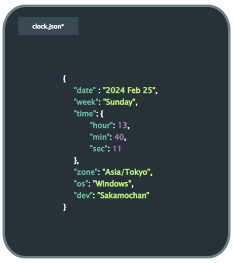

### [clock.json](https://Sakamochanq.github.io/JsonClock)  

<br>
 
Digital clock that imitates the Json format.  
Hours, minutes, and seconds are indicated for each item.  
It uses the span tag, but there may be a better way.  

> [issue](https://github.com/Sakamochanq/JsonClock/issues)

<br>
<br>

[](https://github.com/Sakamochanq/JsonClock/blob/master/LICENSE) 

---

### screenie

<a href="#">
    
</a>

<br>

### More

In addition, the API of ipinfo.io is used to obtain the user's timezone.

<br>

### installation

Repository Clone
```bash
git clone https://github.com/Sakamochanq/JsonClock.git
```

Change Directory
```bash
cd JsonClock
```
